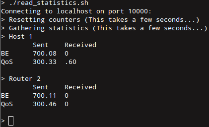

## Telecommunications + Distributed Systems Project
Integrated project for [Telecommunications systems](https://www.uantwerpen.be/popup/opleidingsonderdeel.aspx?catalognr=1001WETTEL&taal=en&aj=2015) and [Distributed Systems courses](https://www.uantwerpen.be/popup/opleidingsonderdeel.aspx?catalognr=1001WETIGS&taal=en&aj=2015) at the University of Antwerp.   
For more specific information, see READMEs in subdirectories.

## Distributed Systems: Chat app with Apache Avro
chat-app is a CLI java application which allows users to communicate with each other using a server-clients architecture (with [Apache Avro](https://avro.apache.org/)).   
Using the application, clients can chat with one another in public or private chat mode. 
Video streaming is also supported. Features which are implemented are listed in features.txt. 
More information about the implementation can be found in architecture.txt.
  

## Telecommunications systems: RSVP in Click

Implementation of the Resource ReSerVation Protocol (RFCs [2205](telecommunications-systems/rfc2205.pdf) and [2210](telecommunications-systems/rfc2210.pdf)) in userlevel [Click](http://read.cs.ucla.edu/click/click).  

## Integration

A video session in the chat-app will, using custom components in Click, set up a path reservation with RSVP. The reservation can also be set up outside of the chat-app.  
Videos can be streamed with Quality of Service. Video streaming is possible in one or in both ways between two clients.  
To make the QoS reservation work, certains scripts need to be running before the Chat App Clients (see list of steps).
The application will still work without QoS if these scripts are not running.

#### Steps to test integration (using 2 PCs)
We use Click scripts (in telecommunications-systems/scripts) which create a virtual network that is limited to 1Mbps. Videos can be streamed with Quality of Service over this virtual network.

1. On PC 1:
  * run setup_ds_server.sh
  * run host2.click -p 10000
  * run AppServer
  * run AppClient
    * Server IP = 192.168.11.1, Client IP = 192.168.11.1
2. On PC 2:
  * run setup_click.sh
  * run ipnetwork.click -p 10000
  * run AppClient
    * Server IP = 192.168.11.1, Client IP = 192.168.10.1
3. Start a private chat session between the two AppClient instances.
4. Request a reservation (= send a path message), write "?videoRequest" or "?vr".
5. Accept a reservation (= send a resv message and construct reservation path), write "?acceptVideo" or "?av".
6. Select a video to stream.
7. Generate background traffic from PC 2 to PC 1
   * iperf -c 192.168.11.1 -l 9999MB -u -b 500K
8. Confirm that the video is streamed with Quality of Service by executing read_statistics.sh on PC 2.
   * On PC 2 because read_statistics.sh looks for Click elements in ipnetwork.click

The integration was tested on the university's lab PCs, which had a direct ethernet connection.

### Authors
* [Josse Coen](https://github.com/jsscn)
* [Armin Halilovic](https://github.com/arminnh)
