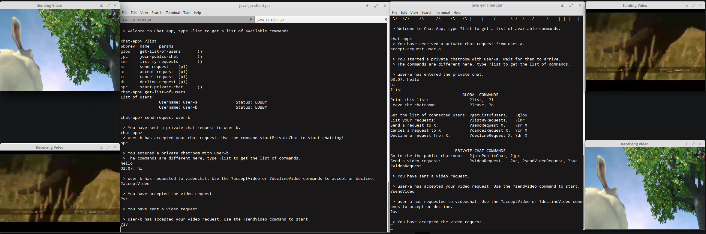

# TeleCommunications + Distributed Systems Project
Integrated project for [TeleCommunications systems](https://www.uantwerpen.be/popup/opleidingsonderdeel.aspx?catalognr=1001WETTEL&taal=en&aj=2015) + [Distributed Systems courses](https://www.uantwerpen.be/popup/opleidingsonderdeel.aspx?catalognr=1001WETIGS&taal=en&aj=2015) at the University of Antwerp.
For more specific information, see READMEs in subdirectories.

# Distributed Systems: Chat app with Apache Avro

# TeleCommunications systems: RSVP in Click

# Integration

A video session in the chat-app will, using custom components in Click, set up a path reservation with RSVP. The reservation can also be set up outside of the chat-app.
Videos will then be streamed with Quality of Service. Video streaming is possible in one or in both ways between two users.
To make the QoS reservation work, certains scripts need to be running before the Chat App Clients (see list of steps).
The application will still work without QoS if these scripts are not running.

## Steps to test integrations (using 2 PCs)
1. Run setup_ds_server.sh on a PC. Then, run host2.click -p 10000.
2. Run AppServer on the same PC as in step 1.
3. Run AppClient on the same PC.
4. Run setup_click.sh on another PC.
5. Run AppClient on the same PC as in step 4. Then, run ipnetwork.click -p 10000.
6. Start a private chat session between the two AppClient instances.
7. To request a reservation (= send a path message), write "?videoRequest" or "?vr".
8. To accept a reservation (= send a resv message and construct reservation path), write "?acceptVideo" of "?av".
9. Select a video to stream.
10. Confirm that the video is streamed with Quality of Service by executing read_statistics.sh

# Authors
Josse Coen      -   20134090
Armin Halilovic -   20122210
